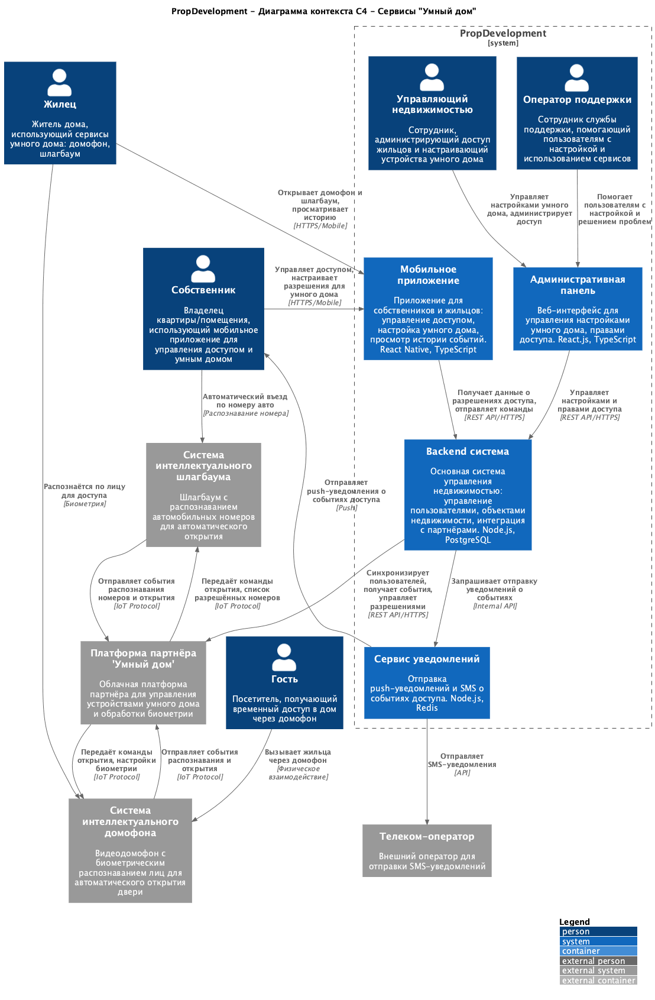

# Задание 3. Внешние интеграции

## C4 диаграмма контекста

## Обновленная схема контейнеров

[Обновленная схема контейнеров](./diagrams/PropDevelopment_С4_model.drawio.xml)

## Требования к внешним интеграциям для сервисов "Умный дом"

### Список требований

- Проверять права доступа к ресурсам, связанным с каждым идентификатором.
- Использовать безопасные токены вместо идентификаторов, передаваемых через URL.
- Шифровать идентификаторы.
- Использовать uuid для генерации идентификаторов
- Установить строгие проверки прав доступа.
- Использовать единые и обобщённые сообщения об ошибках, чтобы не раскрывать информацию о существовании учётной записи.
- Ограничить публичный доступ к информации о структуре идентификаторов
- Применять флаги безопасности для куки (HttpOnly, Secure).
- Использовать только зашифрованные соединения (HTTPS, VPN).
- Реализовать проверку целостности сообщений для предотвращения изменения данных при передаче.

### Аутентификация

В качестве протокола аутентификации будет использоваться OAuth 2.0. Это наиболее популярный и подходящий протокол для данной задачи, позволяет сторонним приложениям безопасно получать ограниченный доступ к ресурсам без передачи учётных данных пользователя.

### Формат токенов

- Токены доступа в формате **JWT (JSON Web Token)**
- Подпись токенов алгоритмом **RS256** или **ES256**
- Ограниченный срок жизни токенов: не более 1 часа
- Автоматическое обновление токенов до истечения срока действия

### Организация взаимодействия между системами

**Шаг 1. Запрос от пользователя**

- Пользователь взаимодействует с мобильным приложением PropDevelopment (открытие двери, регистрация биометрии, добавление автомобильного номера)

**Шаг 2. Обработка в tenant-core-app**

- Мобильное приложение отправляет запрос в `tenant-core-app` (сервис для собственников)
- Происходит аутентификация пользователя и базовая валидация запроса

**Шаг 3. Бизнес-логика в smart-home-service**

- Запрос передаётся в `smart-home-service` (сервис бизнес-логики умного дома)
- Проверяются разрешения пользователя на доступ к конкретному устройству
- Валидируются данные
- При необходимости происходит шифрование чувствительных данных

**Шаг 4. Интеграция через smart-home-gateway**

- `smart-home-service` передаёт запрос в `smart-home-gateway` (API-шлюз интеграции)
- `smart-home-gateway` аутентифицируется на платформе партнёра используя OAuth 2.0
- Формируется запрос к внешнему API в нужном формате

**Шаг 5. Защищённая передача через сеть**

- Запрос передаётся через защищённое соединение
- Используется протокол REST API (для синхронных операций) или WebSocket (для real-time событий)
- Трафик проходит через Firewall для дополнительной защиты

**Шаг 6. Обработка на платформе партнёра**

- Запрос попадает в API Gateway платформы партнёра "Умный дом"
- Auth Service проверяет токен доступа и права
- Device Management обрабатывает запрос и передаёт команду на устройства через IoT Protocol

**Шаг 7. Выполнение на устройстве**

- Команда поступает на интеллектуальное устройство (домофон или шлагбаум)
- Устройство выполняет действие (открытие двери, распознавание лица/номера)

**Шаг 8. Обратный поток событий (WebSocket)**

- Устройство отправляет событие на платформу партнёра (дверь открыта, лицо распознано)
- Событие передаётся через WebSocket соединение в `smart-home-gateway` PropDevelopment
- `smart-home-service` сохраняет событие в базе данных
- `notification-service` отправляет push-уведомление пользователю
- Событие передаётся в хранилище данных (DWH) для аналитики
